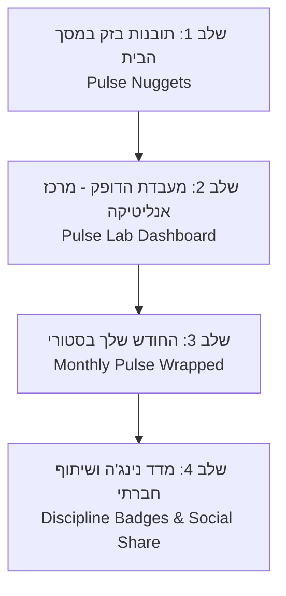

# PulseBudget — מסמך אפיון מוצר: תובנות חכמות ו-BI לצעירים (PRD)

**שם הפרויקט:** PulseBI & Smart Insights (חוכמת תקציב בדופק גבוה)  
**גרסת מסמך:** 1.0  
**תאריך יצירה:** ספטמבר 2026  
**קהל יעד עיקרי:** צעירים בגילאי 15–30 (בני נוער, חיילים, שירות לאומי, סטודנטים, צעירים בתחילת הקריירה)  
**שפה וסגנון (Tone & Voice):** עברית קלילה, ישירה, חברית, יומיומית ומעצימה ("סלנג נקי", ללא מושגים בנקאיים כבדים או מילים מנופחות)  
**מיקום קובץ:** `docs/BI_INSIGHTS_PRD_HE.md`  
**סטטוס:** תכנון מפורט לקראת פיתוח מדורג (Phased Implementation)

---

## 1. חזון ומוטיבציה (Product Vision)

### 1.1 למה צעירים צריכים את זה?
צעירים (15–30) חיים בעולם של סיפוקים מיידיים: וולט, קניות אונליין, קפה בדרך ללימודים או לצבא, יציאות בסופ"ש ומנויים דיגיטליים (Netflix, Spotify, כושר).  
רובם המכריע:
- **נרתעים ממספרים וטבלאות אקסל משעממות:** מילים כמו "תזרים מזומנים", "הקצאת נכסים" או "ניתוח ואריאנס" גורמות להם לסגור את האפליקציה במקום.
- **רוצים לדעת "תכל'ס":** *"כמה נשאר לי לזרום עד סוף החודש?"*, *"איזה יום בשבוע גומר לי את הכסף?"*, *"מי בולען הכסף הכי גדול שלי החודש?"*.
- **אוהבים פידבק ויזואלי ומספק:** תגים, צבעי ניאון, אנימציות קצרות וסיכום בסגנון "Spotify Wrapped" שכיף לראות ואפילו להשוויץ איתו לחברים.

### 1.2 עקרונות השפה והתוכן (Design & Voice Principles)
1. **אפס ז'רגון כבד:** לא "ניתוח פארטו פרוגנוסטי", אלא **"בולעני הכסף שלך"**. לא "חיזוי תזרים אקספוננציאלי", אלא **"איך תסיים את החודש בקצב הזה"**. לא "תשואת עודף", אלא **"כסף שנשאר לך בכיס"**.
2. **אופטימיות ומעשים קטנים:** לא לנזוף במשתמש ("חרגת באשמתך"), אלא לתת טיפ חכם ומגניב ("טיפ של אלופים: שים לב לימי חמישי").
3. **עיצוב Dark Neon עתידני:** המשך ישיר של שפת הזכוכית והניאון של PulseBudget, מותאם לצפייה מהירה בטלפון.

---

## 2. מפת דרכים מדורגת (Phased Roadmap)



---

## 3. פירוט השלבים והדרישות הפונקציונליות

### שלב 1: כרטיסיית "תובנות בזק" במסך הבית (Pulse Nuggets)
> **מטרה:** להציג למשתמש משפט אחד קולע, חכם ומעניין בכל כניסה לאפליקציה, בלי שהוא יצטרך ללחוץ על שום כפתור.

#### 3.1.1 מיקום ומבנה בממשק (UI Placement)
- **מיקום:** בין ה-Hero (מד הצעדים והטבעת) לבין אזור הגרף, או ישירות מתחת לגרף ומעל לטבלת הקטגוריות.
- **נראות:** כרטיסיית זכוכית מרחפת (Glassmorphism) עם מסגרת ניאון עדינה ואייקון אימוג'י זורם (`💡`, `🔥`, `🎯`, `🍕`, `⚡`).
- **אינטראקציה:** תובנה מתחלפת אוטומטית או באמצעות חיצי דפדוף ימינה/שמאלה (`<` / `>`) ומונה נקודות (Carousel Dots).

#### 3.1.2 מנוע יצירת התובנות (Smart Rules Engine)
המנוע מנתח את כל התנועות והתקרות בזמן אמת ומייצר מגוון משפטים חדים:

| סוג תובנה | לוגיקת חישוב ברקע | דוגמה לניסוח (בעברית צעירה וקלילה) |
| :--- | :--- | :--- |
| **תחזית סוף חודש** | הוצאה מצטברת + (ממוצע יומי $\times$ ימים שנותרו בחודש) | *"בקצב הנוכחי אתה סוגר את החודש עם עודף של ₪420 בכיס! תמשיך ככה 💪"* או *"קצב קצת מהיר: בקצב הזה ב-24 לחודש נגמרת התקרה 🛑"* |
| **בולען הכסף של השבוע** | הקטגוריה עם סך ההוצאה הגבוה ביותר ב-7 הימים האחרונים | *"השבוע 'אוכל ומסעדות' לקח לך 48% מכל ההוצאות 🍔 שווה לשים עין."* |
| **אפקט סוף השבוע** | השוואת ממוצע יומי בחמישי-שבת מול ראשון-רביעי | *"בסופ"ש אתה שורף פי 2.1 יותר מאשר באמצע השבוע 🎉 סבבה לגמרי, רק תתכונן!"* |
| **תקציב מומלץ ליום** | $\frac{\text{יתרת תקרה שנותרה}}{\text{מספר הימים שנותרו בחודש}}$ | *"נשארו 10 ימים לחודש — אם תשמור על כ-₪140 ליום, אתה יוצא מלך 👑"* |
| **תנועות קטנות שמצטברות** | ספירת הוצאות מתחת ל-₪35 (קפה/נשנושים) | *"שמת לב? קניות קטנות של עד ₪30 הצטברו החודש כבר ל-₪390 ☕"* |
| **סופרסטאר חיסכון** | 0 חריגות ב-7 הימים האחרונים | *"שבוע מושלם! שום קטגוריה לא חרגה ב-7 הימים האחרונים 🔥"* |

---

### שלב 2: מעבדת הדופק — מסך אנליטיקה ו-BI מעמיק (Pulse Lab)
> **מטרה:** מתחם ויזואלי ייעודי שמאפשר לצלול לעומק הנתונים בצורה אינטראקטיבית, חלקה וממכרת.

#### 3.2.1 דרך הגישה (Entry Point)
- כפתור גרף מעוצב בשורה העליונה לצד הפעמון והפרופיל עם אייקון מעבדה/גרף (`Pulse Lab` / `דופק BI`).
- אפשרות ללחיצה ישירה על כרטיסיית "תובנות בזק" משלב 1 שמרחיבה את המשתמש ישירות למסך המלא.

#### 3.2.2 מדדים ורכיבים במסך המעבדה:

1. **לוח השעונים הראשי (Quick Pulse Cards):**
   - **"כמה כסף נשאר לזרום" (Monthly Safe Runway):** תחזית עודף/חוסר צפוי לסוף החודש במספר ניאון גדול ומודגש.
   - **"מדד החיסכון" (Cash Kept %):** אחוז מתוך ההכנסות שנשאר פנוי ולא בוזבז.
   - **"היום הכי יקר שלך" (Peak Spend Day):** איזה יום בשבוע שובר שיאים בהוצאות (למשל: ימי חמישי).

2. **גלגל בולעני הכסף (Category Donut & Pareto):**
   - גרף עוגה/דונאט אינטראקטיבי המציג אילו 3 קטגוריות מחזיקות ברוב המוחלט של ההוצאות.
   - בלחיצה על קטגוריה: פילוח מהיר של ההוצאות הגדולות ביותר שנרשמו בה.

3. **מפת החום של השבוע (Weekly Vibe Heatmap):**
   - שורת 7 ימי השבוע בצבעי חום-קור (ניאון ירוק ליום חסכוני, כתום ליום בינוני, אדום ליום יקר במיוחד).
   - מאפשר להבין בשנייה את הרגלי החיים (למשל: חייל שחוזר בסופ"ש ומוציא בעיקר בשישי, או סטודנט שקונה מצרכים ביום ראשון).

4. **איפה הכסף הולך? (Top Places & Merchants):**
   - זיהוי אוטומטי מתוך שדה ההערה/בית העסק: 5 המקומות שקיבלו ממך הכי הרבה שקלים החודש (למשל: "וולט", "שופרסל", "תחנת דלק", "זארה").

---

### שלב 3: "החודש שלך ב-Pulse" (Monthly Pulse Wrapped)
> **מטרה:** חוויה חודשית ויראלית וכיפית בסגנון "Spotify Wrapped" או "Instagram Stories" שמסכמת את החודש הקודם ומעניקה תחושת סיפוק.

#### 3.3.1 טריגר וחוויית משתמש
- ב-1 לכל חודש קלנדרי, מופיע באנר זוהר וחגיגי במסך הראשי:  
  *"החודש שעבר נסגר! בוא לראות איך היית ב-Pulse Wrapped 🚀"*.
- לחיצה פותחת חלונית מסך מלא מודרנית עם מעבר אוטומטי בין 4–5 שקופיות קצרות, צבעוניות ומונפשות (כולל אפשרות לדלג קדימה ואחורה בלחיצה על צידי המסך).

#### 3.3.2 מבנה השקופיות ב-Wrapped:
1. **שקופית 1 — המספר הכולל:**  
   *"החודש הזה העברת ב-Pulse סך הכל ₪X,XXX ב-YY תנועות."*
2. **שקופית 2 — המלכה של החודש:**  
   *"הקטגוריה שלקחה את המקום הראשון: [שם קטגוריה + אימוג'י] עם ₪ZZZ!"*
3. **שקופית 3 — רגע השיא:**  
   *"היום שבו הרגשת מיליונר: ב-14 לחודש הוצאת ₪720 ביום אחד 🎉"*
4. **שקופית 4 — הישג החיסכון:**  
   *"החדשות הטובות: נשארת עם ₪XXX עודף מתחת לתקרה שהגדרת 🏆"*
5. **שקופית 5 — כרטיס הסיכום והתואר האישי:**  
   - כרטיס מסכם מעוצב עם "כינוי החודש":
     - *"מאסטר השליטה"* (מי שעמד בכל התקרות)
     - *"חובב החיים הטובים"* (מי שהשקיע בעיקר באוכל ובילויים)
     - *"המתמיד השקט"* (מי שרשם הוצאות בעקביות כל יום)
   - כפתור סגירה מהיר לחזרה לשגרה.

---

### שלב 4: מדד הנינג'ה ושיתוף הישגים (Discipline Badges & Social Sharing)
> **מטרה:** גיימיפיקציה מלאה שמעודדת חזרתיות יומית ושמירה על התקציב.

#### 3.4.1 תגי כבוד והישגים (Badges System)
- 🎖️ **"רצף של אש" (Streak):** 7 ימים רצופים של רישום תנועה יומית.
- 🛡️ **"שריון ברזל":** שבוע שלם ללא חריגה מאף תקרה.
- 🎯 **"בול בפוני":** סיום חודש בטווח של עד 5% מתחת לתקרה המדויקת.
- ☕ **"גמילה מנשנושים":** שבוע שבו הוצאות "שונות" או "קניות" ירדו בלפחות 20%.

#### 3.4.2 שיתוף מהיר (Cool Snapshot Share)
- בלחיצה אחת: יצירת תמונת סטורי מעוצבת ונקייה (ללא חשיפת מספרים מדויקים וסודיים אם המשתמש מעדיף, אלא באחוזים ותארים) לשיתוף בוואטסאפ או באינסטגרם.

---

## 4. מודל נתונים וארכיטקטורה טכנולוגית (Technical Specifications)

### 4.1 מנוע חישוב מקומי (Zero Server Latency)
- כל חישובי ה-BI מבוצעים ישירות על הנתונים הקיימים בזיכרון (`transactions` ו-`caps`) באמצעות מעבד אנליטיקה קל משקל ב-TypeScript (`src/bi/pulseAnalytics.ts`).
- **אפס עלות שרת ואפס המתנה:** אין צורך בשרתי Backend יקרים — החישוב רץ בצד הלקוח (Client-side) בפחות מ-15 מילי-שניות עבור אלפי תנועות.

### 4.2 טיפוסי נתונים מומלצים (`src/bi/types.ts`)
```typescript
export interface SmartInsight {
  id: string;
  type: 'forecast' | 'peak_day' | 'top_category' | 'daily_allowance' | 'small_expenses' | 'safe_streak';
  emoji: string;
  title: string;
  body: string;
  tone: 'positive' | 'warning' | 'neutral';
  metricValue?: number;
  actionText?: string;
}

export interface MonthlyWrappedData {
  month: string; // YYYY-MM
  totalSpent: number;
  totalIncome: number;
  netSaved: number;
  topCategory: { id: string; name: string; icon: string; amount: number; percent: number };
  peakDay: { date: string; dayOfWeek: string; amount: number };
  dailyAverage: number;
  userTitle: string; // e.g., "מאסטר השליטה"
  streakDays: number;
}
```

---

## 5. דרישות לא-פונקציונליות ועיצוב (UI/UX & Non-Functional)

1. **מהירות תגובה וקלילות:** כרטיסיית התובנות מתעדכנת בזמן אמת עם כל תנועה חדשה או מחיקה תוך פחות מ-16 מילי-שניות (60FPS).
2. **התאמה מלאה למובייל (Mobile First):** גלילה אופקית קלה באגודל, גודל פונטים קריא, אזורי מגע נדיבים.
3. **פרטיות מוחלטת:** כל ניתוחי ה-BI נשארים במכשיר של המשתמש ובחשבון ה-Firestore המבודד שלו; אין שליחת מידע לצד שלישי.
4. **עברית ו-RTL טבעי:** יישור מדויק, ספרות וסמלי ₪ מיושרים ללא שבירות שורה מביכות.

---

## 6. סיכום תכנית העבודה לפי שלבים

| שלב | רכיב מרכזי | זמן פיתוח משוער | תוצר למשתמש |
| :--- | :--- | :--- | :--- |
| **שלב 1** | ווידג'ט "תובנות בזק" (Pulse Nuggets) | מהיר ומיידי | כרטיסיית תובנה אחת חכמה ומתחלפת במסך הבית |
| **שלב 2** | מסך מעבדת הדופק (Pulse Lab BI) | בינוני | דשבורד מפורט עם מפת חום שבועית, בולעני כסף ותחזית סגירת חודש |
| **שלב 3** | סיכום חודשי (Pulse Wrapped) | בינוני | סטוריז מעוצבים וחווייתיים בכל תחילת חודש |
| **שלב 4** | תגים, מדד נינג'ה ושיתוף | קל | גיימיפיקציה, תגי התמדה ושיתוף קל לחברים |
